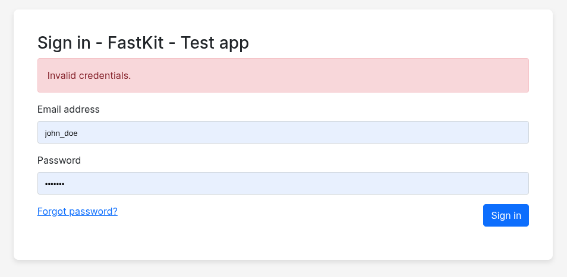
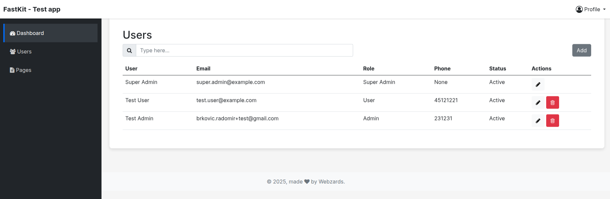
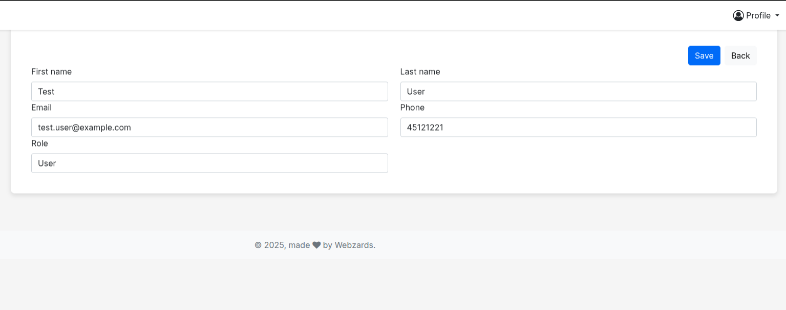
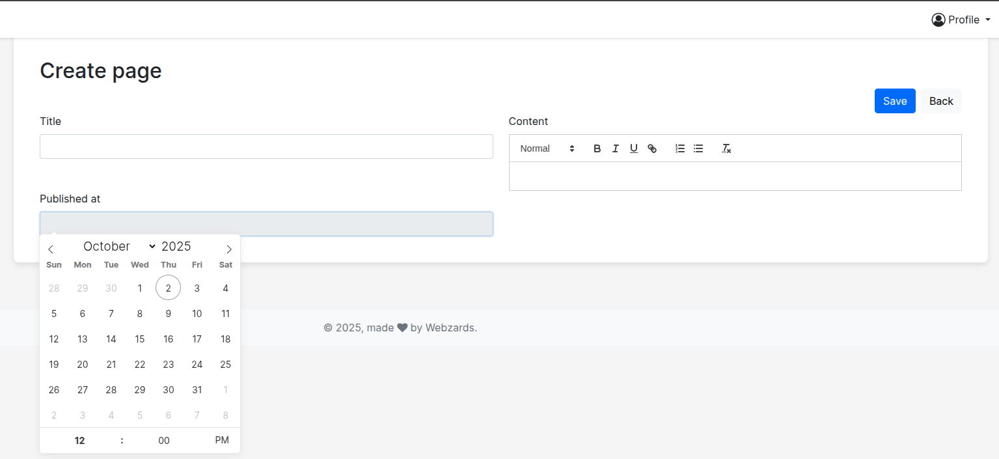

# ⚡ FastKit

FastKit is a lightweight **starter admin panel** for web applications built with [FastAPI](https://fastapi.tiangolo.com/), [PostgreSQL](https://www.postgresql.org/), and Docker.  
The UI is based on the beautiful [Bootstrap 5](https://getbootstrap.com/docs/5.0/getting-started/introduction/) template.  

It provides a solid foundation with features that most apps need out-of-the-box, so you can focus on building what makes your project unique.

## ✨ Features

- 🔐 **User & Role Management** – authentication, user accounts, and role-based permissions  
- 📄 **Public Pages** – create and manage basic pages for your app  
- 📊 **Dashboard** – modern Tailwind-powered admin interface  
- 🐳 **Dockerized** – easy local setup and deployment  
- ⚡ **FastAPI** – async backend with automatic OpenAPI docs  
- 🗄️ **PostgreSQL** – reliable and production-ready database  

## 🖼️ FastKit Admin Panel






## 🛠️ Tech Stack

- [FastAPI](https://fastapi.tiangolo.com/) – modern async Python web framework  
- [PostgreSQL](https://www.postgresql.org/) – database  
- [SQLAlchemy](https://www.sqlalchemy.org/) – ORM (if you’re using it)  
- [Docker](https://www.docker.com/) – containerization  
- [Bootstrap 5](https://getbootstrap.com/docs/5.0/getting-started/introduction/) – frontend UI

## 📁 File structure
```
fast-kit/
├── infrastructure/
├── middlewares/
├── migrations/
├── models/
├── repositories/
├── routers/
├── schemas/
├── seeders/
├── services/
├── static/               # assets
│   └── assets/
├── templates/            # admin templates
│   └── admin/
├── tests/
├── translations/
├── .env.exmaple
├── .gitignore
├── README.md
├── alembic.ini
├── cli.py
├── docker-compose.yml
├── main.py
├── pytest.ini
└── requirements.txt

```


## 🚀 Getting Started

### 1. Clone the repository
```bash
git clone https://github.com/radomirbrkovic/fast-kit.git
cd fast-kit
```

### 2. Create environment file
``` 
cp .env.example .env 
```


### 3. Start with Docker
``` 
docker-compose up --build 
```

### 4. Create and activate a virtual environment:

``` python3 -m venv venv
    source venv/bin/activate  # on Linux / macOS
    venv\Scripts\activate     # on Windows
```


Install dependencies:
```
pip install -r requirements.txt
```

Start the app:
```
 uvicorn app.main:app --reload
  ```

### 5. Running seeders 

``` 
python seeders/users_table_seeder.py
 ```

Open in browser:
👉 http://localhost:8000

Swagger UI → http://localhost:8000/docs

Admin → http://localhost:8000/admin

